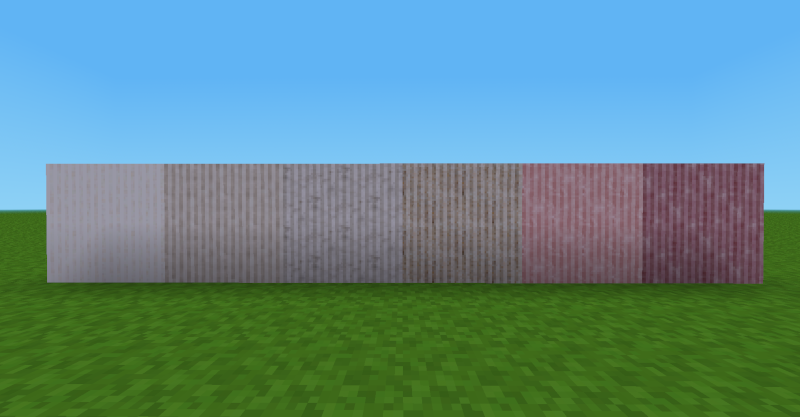

# Quarz

**DESCRIPTION:**
Der Mod »Quarz« fügt dem Spiel einige Blöcke mit Quarz-Textur hinzu.

**DESCRIPTION:**
The mod »Quarz« (quarz) adds quartz blocks to Minetest/Luanti.  

**USE:**
Search the inventory for »quarz« (not »quartz«)  

**INSTALL:**
Unzip the downloaded folder and rename it to »mod name« (if necessary). Copy the folder into your »luanti/mods« folder. 

**DEPENDS:**
This mod requires »default« (»[minetest_game](https://content.luanti.org/packages/Minetest/minetest_game/)«) to work correctly.

**LICENSE:**  
Author: This mod was made by [Norbert Thien, multimediamobil – Region Süd (mmmsued)](https://minetest-modding.weebly.com/), 2025   
Code: Except otherwise specified, all code in this project is licensed as LGPLv3.  
Media: Except otherwise specified, all media and any other content in this project which is not source code is licensed as CC BY SA 3.0.